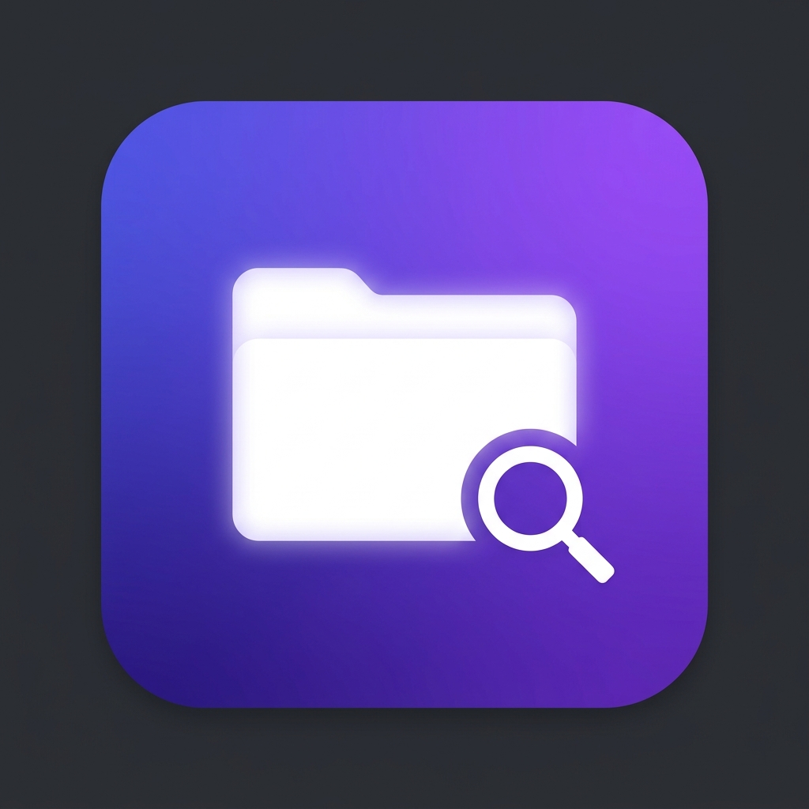

# 🗂️ FolderScope — Desktop Manager & Spreadsheet API

**FolderScope** adalah aplikasi desktop modern berbasis Electron.js yang dirancang untuk manajemen file lokal dan pengolahan data API Spreadsheet. Aplikasi ini menawarkan antarmuka premium, performa cepat, dan fitur persistensi data yang kuat.



## ✨ Fitur Utama (v1.1.0)
- **Explorer Mode:** Menjelajahi folder lokal dengan tampilan Grid atau List yang elegan.
- **Search Engine:** Pencarian file rekursif yang cepat dengan opsi *Case Sensitive* dan *Exact Match*.
- **Spreadsheet API (New):** Menarik data langsung dari JSON API ke dalam tabel spreadsheet yang interaktif.
- **Smart Filtering:** 
  - Filter file berdasarkan kategori (Gambar, Video, Kode, Dokumen, Arsip).
  - Filter status data spreadsheet (Lengkap / Tidak Lengkap) berdasarkan validasi parameter P, L, T, dan B.
- **Local Persistence:** Aplikasi mengingat folder terakhir yang Anda pilih dan melakukan caching pada data spreadsheet API sehingga data tetap tersedia saat aplikasi dibuka kembali.
- **Modern UI/UX:** Tampilan gelap (Dark Mode) premium dengan animasi halus dan *Auto-hide Toolbar* yang cerdas.

## 🚀 Instalasi (Development)

Jika Anda ingin menjalankan aplikasi ini dari kode sumber:

1.  **Prasyarat:** Pastikan [Node.js](https://nodejs.org/) sudah terinstal di komputer Anda.
2.  **Install Dependensi:**
    ```bash
    npm install
    ```
3.  **Jalankan Aplikasi:**
    ```bash
    npm run dev
    ```
    *(Gunakan `npm run dev` untuk mengaktifkan fitur debugging).*

## 📦 Build Menjadi Aplikasi (.exe)

Untuk mengompilasi kode ini menjadi aplikasi siap pakai (.exe):

1.  **Build Installer (NSIS):**
    Menghasilkan file `.exe` setup yang bisa diinstal di komputer lain.
    ```bash
    npm run build:installer
    ```
2.  **Build Portable version:**
    Menghasilkan satu file `.exe` mandiri (Tanpa Install).
    ```bash
    npm run build:portable
    ```

## 🛠️ Tech Stack
- **Core:** JavaScript (ES6+), HTML5, CSS3 (Vanilla).
- **Framework:** [Electron.js](https://www.electronjs.org/)
- **Build Tool:** [electron-builder](https://www.electron.build/)

## 📝 Lisensi
Distribusi di bawah lisensi ISC.

---
Dibuat dengan ❤️ untuk efisiensi kerja yang lebih baik.
